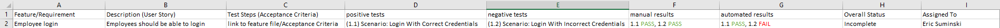

# Automation Testing
## Test Suite vs Test Case
- Test Suite: a collection of tests
- Test Case: a single test
## Requirements Traceablity Matrix
This is a document that provides detailed information about what is being tested, how it was tested, its testing status, and who is doing the testing.

## TestNG data provider
testNG has a built in report generation system you can leverage when running your tests, and it requires very minimal setup to access. The easy way to do this in intellij is to edit the run configuration
1. go to edit configuration
2. navigate to the testNG section in the leftmost panel
3. go to the listeners tab in the configuration menu
4. check the "use default listeners" box
5. click apply and ok

Now when you run your test suite (assuming you did this for the whole suite, not just a class or two) you will get an html generated report. Alternatively, you can create a testng.xml file and configure it to run your tests.

1. create a file called testng.xml in the root folder
2. add the following lines to the file:
```xml
<?xml version = "1.0" encoding = "UTF-8"?>
<!DOCTYPE suite SYSTEM "https://testng.org/testng-1.0.dtd" >
```
3. next add your test suites to the xml
```xml
<?xml version = "1.0" encoding = "UTF-8"?>
<!DOCTYPE suite SYSTEM "https://testng.org/testng-1.0.dtd" >
<suite name = "Test Suite name">

</suite>
<!-- you can have multiple suites in a file -->
```
4. next add your different tests to the suites
```xml
<?xml version = "1.0" encoding = "UTF-8"?>
<!DOCTYPE suite SYSTEM "https://testng.org/testng-1.0.dtd" >
<suite name = "Test Suite name">
    <test name = "Functionality being tested">
        
    </test>
</suite>
```
5. finally, add whatever classes hold the actual tests
```xml
<?xml version = "1.0" encoding = "UTF-8"?>
<!DOCTYPE suite SYSTEM "https://testng.org/testng-1.0.dtd" >
<suite name = "Test Suite name">
    <test name = "Functionality being tested">
        <classes>
            <class name = "dev.suminski.tests.BasicTests" />
        </classes>
    </test>
</suite>
```
6. you can then set up your configuration to "run" the xml file, which will prompt testNG to run the tests you specified and codify their results in its generated reports (as long as you turn on the basic listener)
## Mockito for Java (Stubbing)
There may come a point while testing where it becomes tedious to constantly ping your database for tests, or you want to run unit tests on the second or third layer of your application (the service or controler layer). You can mock your tests to achieve this. Mockito is a framework that allows you to do this with Java.
1. first add the necessary dependencies to your pom.xml (you will need to grab the testNG compatable version of Mockito if using testNG)
```xml
        <!-- https://mvnrepository.com/artifact/org.testng/testng -->
        <dependency>
            <groupId>org.testng</groupId>
            <artifactId>testng</artifactId>
            <version>7.4.0</version>
            <scope>test</scope>
        </dependency>
        <!-- https://mvnrepository.com/artifact/org.mockito/mockito-testng -->
        <dependency>
            <groupId>org.mockito</groupId>
            <artifactId>mockito-testng</artifactId>
            <version>0.4.13</version>
            <scope>test</scope>
        </dependency>
```
2. You will then need your methods you are testing. for this example I am using a simple math function inside a class that is injected into a calculator class
```java
public class Mathy {
    public int mathematics(int num){
        return num / 2;
    }
}

public class Calculator {
    
    public Mathy mathy;
    
    public Calculator (Mathy mathy){
        this.mathy = mathy;
    }

    public String evenOdd(int num){
        int result = mathy.mathematics(num);
        if (result % 2 == 0){
            return "even";
        } else {
            return "odd";
        }
    }
}
```
3. once your classes and methods are set you need to create a test class. Create the two classes but set them to null at the start
```java
public class MockingTests {
    public Mathy mathy;
    public Calculator calculator;
}
```
4. Use the @BeforeAll annotation to create a setup method. Inside this method you are going to initialize the Mathy class as a Mockito object and pass in the Mathy class as an argument. This will allow you to mock the data you give and receive from the class
```java
@BeforeAll
public static void setup(){

    // because I am mocking the mathy class I instantiate it as a mock class
    mathy = Mockito.mock(Mathy.class);
    // I can then inject the mocked class and it works
    calculator = new Calculator(mathy);

}
```
5. You can now write your tests for the calculator method we are testing, but instead of having to pass in real values you can use Mockito to determine what goes into the method and what comes out
```java
@Test
public void mockReturnControl(){
    // look how I can control the return value here:
    // normally I would mock the value returned from a database, or something else that it is
    // impractical to constantly run test methods on
    Mockito.when(mathy.mathematics(5)).thenReturn(3); // this method would ACTUALLy return 2, but I can control the return
    String result = calculator.evenOdd(5); // this method passes the 5 into our mocked object that then calls the mathematics method which we have mocked
    Assert.assertEquals("odd", result); // this test will pass because 3 is an odd number
}

@Test
public void isEven(){
    Mockito.when(mathy.mathematics(12)).thenReturn(6); // this is the result we would expect, so we make it the return value
    String result = calculator.evenOdd(12);
    Assert.assertEquals("even", result);
}

@Test
public void isOdd(){
    Mockito.when(mathy.mathematics(10)).thenReturn(5); // this is the result we would expect, so we make it the return value
    String result = calculator.evenOdd(10);
    Assert.assertEquals("odd", result);
}

 @Test
    public void checkMathematicsCalledWithCorrectInput(){
        Mockito.when(mathy.mathematics(9)).thenReturn(4);
        calculator.evenOdd(9);
        // verify will throw an exception if the mock object does not call the method with desired input
        // this is true mocking: checking that both the correct method and input are used
        Mockito.verify(mathy).mathematics(9);
    }

    @Test
    public void checkMathematicsCalledCorrectAmountOfTimes(){
        calculator.evenOdd(10);
        calculator.evenOdd(11);
        calculator.evenOdd(11);
        calculator.evenOdd(12);
        // use the times method if you want to check the amount of times a method with input is used
        Mockito.verify(mathy, VerificationModeFactory.times(2)).mathematics(11);
    }
```
6. run your tests and adjust your code as needed!
## Behavior vs State verification
We've talked about behavior and state verification in our application, but it also applies to our project as a whole. Behavior verification should be familiar to us: you are testing to make sure your project's functionality is working as intended. State verification, on the other hand, is a test to make sure that your database has ACTUALLY changed (or not changed) as you intended. These tests are fundamentally different from behavior tests: they are not interested in whether the function works as intended or not. All they are verifying is whether the STATE of the database (or object, etc) is what we expect it to be.
## Web Service Testing
This is what we have been doing with Postman, Cucumber, Behave, and Selenium. It is validating that our http requests are being recieved, handled, and responded to properly.
## Testing Pyramid
There are three general levels of testing you can classify your tests into: unit, integration, and end to end. You can view it like a pyramid, with Unit tests supporting integration, and integration supporting e2e. What this means is that the majority of your tests should be unit tests. Every piece of functionality should have a unit test if possible, and these unit tests should test the intended, unintended, and edge cases. Integrated tests are the next level of the pyramid, which should still be extensive, but by its nature it will not have as many tests as the Unit tests. Finally, End to end tests are at the top of the pyramid and are the least frequent. These can work once your unit tests and integration tests are complete, and you can focus on testing the front end.
## Testing Documents
There are a few general testing documents you should be familiar with, though their implimentation may change from company to company
- Test strategy
    - This is a high level document: it is applicable company-wide
        - includes information on how to report bugs and make test reports
        - API endpoint documentation rules
        - workflow for bug fixes
        - etc
    - includes roles and responsibilities 
- Test plan
    - this is a document that is specific to a particular project
        - contains information on the technologies used in the project
        - contains dealine schedules, important dates
        - documents what is actually being tested
        - also notes what is NOT being tested 
- Test cases
    - these are singular tests (the actual test itself)
- Test results
    - these are collections of tests (test cases) that are related to each other (employee entity tests, employee route tests, etc)
## Testing Mindset
Having a testing mindset is something that you develop overtime. Writing a test to make sure the functinality is working as intended is easy: knowing EVERYTHING that could potentially go wrong and testing for it is far more difficult, and as you learn more about your application, systems you are using, and the peculiarities of the language you are writting with, you will find more comprehensive ways to write tests. This is not an arbitrary requirement companies give their testers: the more efficient your tests are, the greater scalability your app will have. The more comprehensive your tests are the easier it is to answer: "can we make our app do {thing}?" The more comprehensive your tests are the easier it is to immediately know what is and is not possible. There are a few basic testing concepts to keep in mind as you start your testing career:
- Positive Tests
    - how does the function handle correct input?
- Negative Tests
    - how does the function handle incorrect input?
        - right type wrong data
        - wrong type
- Edge cases
    - how does the function handle weird cases or extreme values?
        - how does it handle 0?
        - how does it handle an empty string?
        - how does it handle a really large number/string?
        - how does it handle an sql statement passed as an argument?
- Redundancy
    - are your tests actually telling you something new?
        - passing in strings that are 6, 7, 8, 9, and 10 characters long into a function that takes a max of 5 characters doesn't tell you anything new
        - testing for your function to throw a divide by zero error when you divide by zero is redundant
## Standard Development Lifecycle
## SDLC overview
The SDLC is the workflow for creating a piece of software. There is no "official" or perfect SDLC, and different organizations will have their own take on the SDLC. All of them will have a similar structure as outlined below, or at least include them somewhere in their development lifecycle:
1. Determine Software Requirements
    - this is the first step of developing a piece of software: you need to know/decide what it needs to do
        - does it need to be fast above all else? Easy to use above all else? Look good, even if it does not work? etc.
    - User stories are developed at this time
2. Design the software
    - interfaces are created at this point
    - determine front end technology (angular? plain html/css/js?)
    - determine back end technology (server language? endpoints? entities? services?)
3. develop/test
    - create tests and write code to pass tests
4. deploy
    - software packaging happens at this point
        - web app deployed to AWS, executable jar file created, etc.
5. monitor/perform maintanance
    - keep track of the application while it is use
        - monitor traffic, review logs, keep track of client comments, investigate bugs, etc
## STLC overview
The testing lifecycle is very similar to the SDLC; you can thik of the STLC as a subset of the SDLC.
1. Requirement Analysis
    - what user stories need testing?
2. Create Test Plan
    - What is the workflow for writing tests?
    - how will the testing team be organized?
    - how will our results be stored?
    - what technologies will we use for our testing?
3. Design test cases
    - what are our unit tests?
    - what are our integration tests?
    - what are our End to End tests?
    - what are our positive tests?
    - what are our negative tests?
4. Set up test environment
    - create test server
    - create database with dummy data
    - create mock API endpoints
5. Run tests
    - generate test report
    - report new bugs
## Feature vs Defect
We all know what a feature is: it is some kind of functionality in our application. A defect (or bug) can sometimes be a little trickier to determine. This is because there are just SO MANY WAYS an application can surprise you. You may write your tests, have them all pass, but then users report that their experience is nothing like what you expected it to be. Then there is the "it's not a bug: it's a feature" moments when something unexpected ends up staying in the code because you like what it does to or for the app. Because of this, there is a general defect lifecylce you should follow to determine whether an unexpected instance is truly a defect or a surprise feature
## Defect lifecycle
1. A bug is reported (could be from a test, user reported, etc)
2. the bug is assigned to a person or team
3. The bug is analyzed and/or recreated
    - the bug will either be rejected or deemed worth addressing
    - it could be rejected because the bug could not be reproduced, it is deemed a feature instead of a bug, an upcoming updated will fix the problem, etc
    - in this case, the bug status will be closed/finished, and you move on
4. assuming the bug needs to be addressed/fixed, you work on the code and test it thoroughly
    - if you/ your team can not fix the bug you report it and the bug is reassigned
5. Once the bug is fixed you close the bug status and move on
## Defect Reports
Defect reports are simply how you report a bug. These can be incredibly basic (a text file that list the bugs needing to be fixed) or they can be incredibly complex (including defect id, project and product, release version, summary, descriptions, steps to replicate, expected vs actual results, comments, the list goes on). The means of reporting a defect and the expectations for how it should be done should be available either within the test strategy or test plan documentation. While working on your projects in training you should have a consistent way of reporting problems with your application to your teammates so that everyone is on the same page. It does not need to be fancy or all inclusive, but it should be consistent.
## Severity vs Priority
Severity and Priority are two different metrics for determining how much a defect affects your product. Severity is a measurement of how much the defect affects one or more features, while priority measures how quickly the defect ought to be addressed. Usually the two go hand-in-hand (high priority == high severity) but this is not always the case.
- high priority low severity
    - your company landing page has a competitors' logo in place of your own
    - functionally, this does not affect your website. That being said, promoting your economic cometitor on your home page is not a great buisness move, so it should be fixed ASAP
- low priority high severity
    - your apps function to change names in the company database has completely broken
    - this would be annoying for those who are trying to fix or change their names in the database, but it does not break the ability for the app to do its intended job, so fixing something like the wrong logo on the landing page would be higher priority to fix first
## logging defects
If defect reports are a way of managing bugs as they arrise, logging defects is a way of recording them for posterity. Again, the means of handling defect logging should be available to you in the test strategy/plan documentation, but for your own projects you will want to create a system of codifying and logging the bugs your application runs into. This can be useful for tracking any persistent bugs: knowing that your login system constantly bugs out may indicate you need to rework it from the ground up. Having the log is a good means of determining if such a drastic measure is warranted.