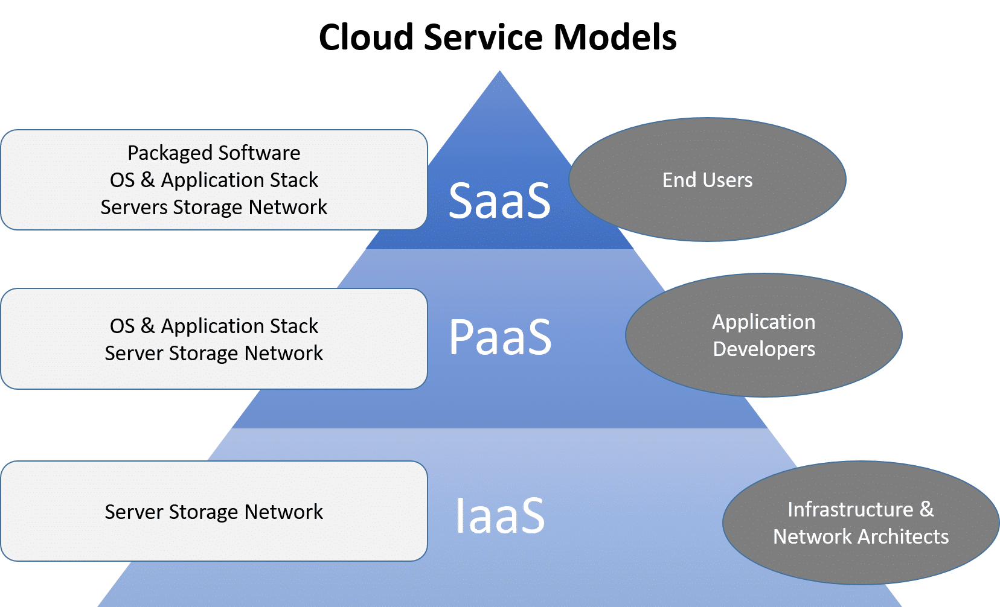
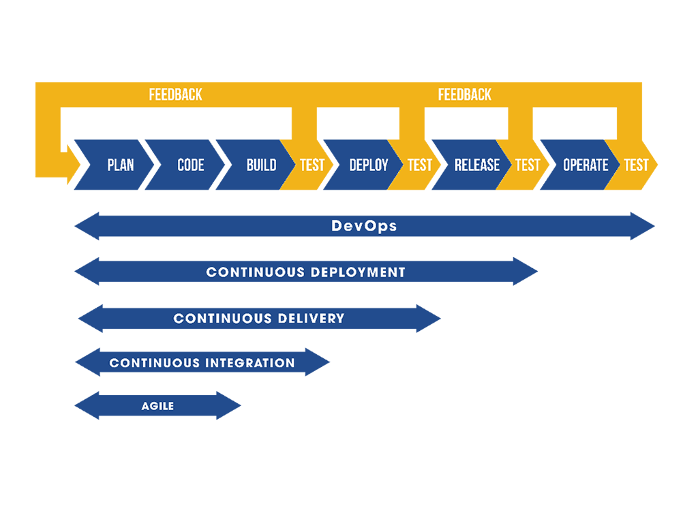

## AWS Introduction (cloud vs on premise)
We have already started to use AWS services, but here we are going to look at it as a whole. AWS has blow up in popularity in recent years, and its success has caused many other Web Services providers to spring up too (Google Cloud Platform, Microsoft Azure are two major competitors). There are six advantages of these web services to be aware of:
1. Trade capital expense for variable expense.
    - instead of needing to guess at your traffic and processing needs you can use a felxible service that scales with your needs, both for the increase and decrease in traffic and processing power need.
2. Benefit from massive economies of scale.
    - because user actions are all aggregated in the cloud (read: it is all localized in the cloud and handled by the web service) you can benefit from a pay-as-you-go model that many web services providers like AWS use.
3. Stop guessing about capacity.
    - similar to the first bulletpoint, there is no need to guess at how much hardware and processing power you need: because of the flexibility of autoscaling you can avoid sitting on idle hardware or being unable to handle all the requests to your product
4. Increase speed and agility.
    - when you host your service locally you have to manually upgrade everything, which can take anywhere from hours to days. With cloud computing you have access to advanced hardware immediately.
5. Eliminate overhead cost of maintaining data centers
    - providers like AWS handle the maintanence of data centers, which means you don't need to budget for the servers, properties,maintanence crew, secruity, etc.
6. Go global in minutes.
    - because most services like AWS have global coverage you can choose what regions you want to deploy your app in and reduce latency and increase accessability of your product with a few mouse clicks

There are three models of Cloud Computing:
- Infastructure as a Service (IaaS):
    - a self-service model for managing remote data center infrastructures. AWS offers IaaS in the form of data centers. Essentially, this means that AWS itself is the IaaS
- Platform as a Service (PaaS):
    - allows organizations to build, run and manage applications without the IT infrastructure. AWS RDS is a PaaS: it provides a means of managing your product (storing the data related to it) without providing any infastructre to manage it (need dbeaver or another program to interface with the database)
- Software as a Service (SaaS):
    -  replaces the traditional on-device software with software that is licensed on a subscription basis. It is centrally hosted in the cloud. A good example is Salesforce

## AWS Regions and Availability
There is a potential downside to cloud based services: latency. The farther data has to travel the longer it takes for your service to work. To get around this AWS offers its services in ~24 different regions, with ~77 available zones in those regions. Regions are major geographic areas that hold physical data centers for Amazon. So, if you are developing in the USA, you want to make sure the region you developing in is close to where you physically are. Or, if you are deploying your product, you want to make sure you deploy it to all the regions where your customers are. 

If regions are the large geographic area, available zones are smaller logic centers within the regions that handle the actual operations. Each region has multiple available zones, each of which has back up power and networking capabilities. This reduces the harm of an available zone failing: if one area goes down the others can handle the workload of the failed zone until it is back up and running.
## DevOps Overview
Software Development and Operations (DevOps) is a methodology that combines the development, deployment, and maintanece of code into a single, streamlined process. Ideally, this process is automated as much as possible. There are 5 general steps to Devops:
1. Source code Control: Producing (writing) code and pushing to a repository
    - you should already be familiar with this step, it is just the creation of your code (following TDD and utilizing BDD) and publishing it to a central repository
2. Building and Testing Automation: Test basic functionality of code (Generally unit testing) and create a new, working build
    - you should be testing your code as you develope, but this is the final, overarching test. This round of testing is the one you want to generate documentation and reports from for either your client or other developers to see
3. Deploying to Staging: Deployment of working build to a temporary environment
    - This is a pre-configured enviornment where you can test the entirety of your application without affecting your production enviornment
4. Acceptance Testing: Undergo other more complex tests (systems, integration) within temporary environment
    - think of this as the final, official BDD test. This is where the entirety of the (supposedly) working application is put to the test. Again, it is from this test you will want to save your generated report and have it available to either the client or other developers
5. Deployment of Build: Migrate working build to Production environment accessible by end users
    - this is the actual deployment of your product

If you are developing with an Agile Mindset there are three practices to know that assist in the process of creating a smooth DevOps pipeline
- Continuous Integration
    - This is the practice of regularly and consistently merging code into a central repository. It also involves reviewing the code to make sure the integration is as smooth as possible
- Continuous Delivery
    - This is the pratice of automating the DevOps pipeline as much as you can. This means once your code is merged into the central repository it is downloaded and built/tested in a staging environment. This means steps 1-3 of the DevOps process should be automated, and step 4 should be too if you can manage it, though this is not always possible. Deploying to the production enviornment (step 5) should be done manually, since step 4 may reveal bugs you need to fix before deployment to production
- Continuous Deployment
    - Continuous Deployment is the process by which the entirety of the DevOps pipeline is automated, including deployment to production. You can think of it as the all encompassing Agile practice of DevOps, with each other practice being a subset of it:
    

_______________________________
## AWS EC2
Amazon's Elastic Compute Cloud (EC2) is a web service that provides secure, resizable compute capacity in the cloud. It is designed to make web-scale cloud computing easier for developers. EC2s offer the following:
- Virtual Computing Environments (images)
- preconfigured templates for your images known as Amazon Machine Images (AMIs). These include the OS and additional software you need
- Various instance types. These have differeing CPUs, memory, storage, and networking capacity
    - an instance is a virtual server in the cloud
- secure login information for your instance. Amazon holds a public key, you keep a private key
- security groups that determine who can access your instance via protocols, ports, and IP ranges

- Elastic Web Scale Computing
    - A major factor in the popularity of Amazon's EC2s is their "elasticity." Elastic Web-Scale Computing means you can add or remove capacity and capability to your instances, or create more instances, with a few clicks of the mouse. This allows for easy scaling. 

- Complete Control
    - As the creator of the instance you have root access to each of your instances, and you can start and stop them without losing access to the data they hold. 

- Flexible Cloud Hosting Services
    - You can mix and match operating systems, cpu, memory, etc with your instances, creating exactly what you need to manage and run your web product.

- Elasticity
    - The "Elasticity" of EC2s is their ability to auto scale both up and down: when your system has higher demand the instance can add more processing power to handle the load, and when the traffic dies down it can revert to a lower processing power, saving you money in the long run.